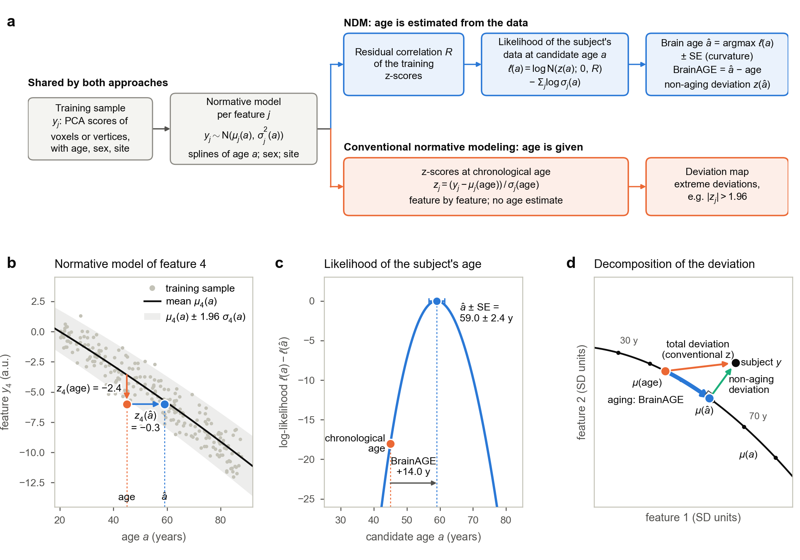

# Brain age from normative models (NDM): methods

> Draft methods section for the NDM brain age (NormBrainAGE) implemented in `neurogamlss.py` of NeuroGAMLSS. Values in square brackets are study-specific and need to be filled in. The notes at the end are for the authors and are not part of the manuscript text.



## Overview

Normative models describe the distribution of a brain feature in a reference population as a function of age and other covariates (Marquand et al., 2016, 2019; Rutherford et al., 2022; Bethlehem et al., 2022). They are usually applied in the forward direction. An individual's data are standardized at the individual's chronological age, and the resulting z-scores, or deviation maps, indicate which features are atypical (Wolfers et al., 2018). Normative deviation mapping (NDM) uses the same models in the reverse direction (Fig. 1a). Age is treated as an unknown parameter of the normative model, and the brain age is the age at which an individual's data are most likely.

Reversing the direction of inference has three consequences. First, the estimate does not regress toward the mean age of the training sample. Regression-based brain age models such as Gaussian process regression (GPR) BrainAGE (Franke et al., 2010; Kalc et al., 2024) approximate the expected age given the image. Such estimates are shrunk toward the mean of the training ages and require a correction of the age bias (Le et al., 2018; Smith et al., 2019; de Lange and Cole, 2020). NDM instead maximizes the likelihood of the image given age, which is the classical estimator of statistical calibration (Eisenhart, 1939; Brown, 1982; Osborne, 1991). For a correctly specified and informative normative model, this estimate is approximately unbiased conditional on chronological age, and no age-bias correction is applied. For independent features with linear age effects and constant variance, it reduces to the biological age estimator of Klemera and Doubal (2006) without their additional term for chronological age. Second, the curvature of the likelihood yields a standard error for each individual estimate. Third, the deviation of an individual from the normative population splits into a shift along the normative aging trajectory, which is the BrainAGE, and a non-aging deviation that an older- or younger-appearing brain does not explain (Fig. 1d).

## Features

T1-weighted images were preprocessed with CAT12 (Gaser et al., 2024). As in our GPR-based workflow (Kalc et al., 2024), we used the affinely registered gray matter (GM) and white matter (WM) segmentations, resampled to [4 and 8] mm and smoothed with Gaussian kernels of [4 and 8] mm full width at half maximum. Each combination of tissue, resampling and smoothing defines one model. The [M] models were analyzed separately and combined at the end (see *Ensemble of models*). Vertex-wise surface measures such as cortical thickness can be used in the same way. When training samples from several studies were pooled, each study was treated as a site. Subjects without a valid age were excluded.

For each model, the voxel- or vertex-wise data of the training sample were reduced by principal component analysis (PCA). Voxels or vertices with non-finite values or zero variance in the training sample were removed. So were near-empty voxels, whose mean over the training subjects was below [0.05], and for surface data vertices whose mean was below [5%] of the median of all vertex means. The same mask was used for the deviation maps. The data were centered with the training mean, and the principal axes were obtained from the eigendecomposition of the $`n \times n`$ Gram matrix of the $`n`$ training subjects. The scores of the first $`K = \min(100, n-1)`$ components are the features $`y_j`$ ($`j = 1, \dots, K`$) of the normative models. Test data were centered with the training mean and projected onto the same axes. PCA does not use age and was repeated in every training set, that is, within every cross-validation fold.

## Location–scale normative models

For every feature $`j`$, we fitted a normal location–scale model in which both the mean and the standard deviation depend on age (Fig. 1b):

```math
y_{ij} \sim \mathcal{N}\left(\mu_j(a_i, s_i, c_i),\ \sigma_j^2(a_i, s_i)\right),
\tag{1}
```

```math
\begin{aligned}
\mu_j(a, s, c) &= \beta_{0j} + \mathbf{b}_\mu(a)^\top \boldsymbol{\beta}_j + \beta_{sj}\, s + \gamma_{cj},
\\ \log \sigma_j(a, s) &= \theta_{0j} + \mathbf{b}_\sigma(a)^\top \boldsymbol{\theta}_j + \theta_{sj}\, s .
\end{aligned}
\tag{2}
```

Here, $`a_i`$ is the age of subject $`i`$, $`s_i`$ its sex (1 for males, 0 for females) and $`c_i`$ its site, with $`\gamma_{1j} = 0`$. The age effects $`\mathbf{b}_\mu(a)`$ and $`\mathbf{b}_\sigma(a)`$ are natural cubic spline bases without intercept (Hastie et al., 2009) with [3] and [1] degrees of freedom. The degrees of freedom were chosen for each model by 5-fold cross-validation within the training sample, with folds stratified by site and age. Those of $`\mu`$ were chosen from 1 to 8 with 3 for $`\sigma`$, and then those of $`\sigma`$ from 1 to 4, by the mean absolute error of the held-out brain age after removing its median. Their knots lie at equally spaced quantiles of the training ages, including boundary knots at the youngest and the oldest age, so the trajectories continue linearly outside the training range. Sex enters the mean and the log standard deviation as a main effect. It is omitted when the training sample contains only one sex or when sex is unknown for the test data. Site enters the mean as a fixed effect. For prediction, the site effect is replaced by its average over the training sites weighted by their sample sizes, $`\bar\gamma_j = \sum_c \pi_c \gamma_{cj}`$, analogous to the standardized mean of ComBat (Johnson et al., 2007). We refer to this as the reference site.

The parameters were estimated by maximum likelihood with the RS algorithm of generalized additive models for location, scale and shape (Rigby and Stasinopoulos, 2005), following its implementation in ComBatLS (Gardner et al., 2024). Starting from ordinary least squares and a constant standard deviation, the algorithm alternates between a weighted least-squares update of the mean parameters, with weights $`\sigma^{-2}`$, and a Fisher scoring step for the parameters of $`\log\sigma`$. For the normal distribution, this step is the least-squares regression of $`(z^2 - 1)/2`$ on the design of $`\log\sigma`$. It is halved, up to 20 times, if the deviance increases. Iterations stopped when the changes of $`\mu`$, in units of $`\sigma`$, and of the $`\log\sigma`$ parameters fell below $`10^{-6}`$, or after 2000 iterations. All features were fitted simultaneously in vectorized form.

The z-scores relative to the normative model at age $`a`$ are

```math
z_j(a) = \frac{y_j - \mu_j(a, s)}{\sigma_j(a, s)},
\tag{3}
```

where $`\mu_j(a, s)`$ refers to the reference site. Conventional normative modeling evaluates (3) at the chronological age (Fig. 1a, orange). NDM treats $`a`$ as unknown (Fig. 1a, blue).

## Residual correlation

PCA scores are uncorrelated in the training sample, but their z-scores are not. Removing the effects of age, sex and site, and scaling each score by its own age-dependent standard deviation, induces correlations between them. We therefore modeled the z-scores of an individual as multivariate normal, $`\mathbf{z} \sim \mathcal{N}(\mathbf{0}, \mathbf{R})`$, and estimated $`\mathbf{R}`$ from the z-scores $`\mathbf{z}_i`$ of the training subjects at their own age, sex and site:

```math
\mathbf{R} = \frac{1}{n} \sum_{i=1}^{n} \mathbf{z}_i \mathbf{z}_i^\top + \psi\, \mathbf{I}, \qquad \psi = 0.01 .
\tag{4}
```

At the maximum likelihood solution, the mean of $`z_{ij}^2`$ over the training subjects is exactly one, so the first term has a unit diagonal. The small ridge $`\psi`$ stabilizes the inverse.

## Brain age as the most likely age

Under (1)–(4), the log-likelihood of the features $`\mathbf{y}`$ of a test subject at a candidate age $`a`$ is

```math
\ell(a) = \log p(\mathbf{y} \mid a, s) = -\frac{1}{2}\, \mathbf{z}(a)^\top \mathbf{R}^{-1} \mathbf{z}(a) - \sum_{j=1}^{K} \log \sigma_j(a, s) + \text{const},
\tag{5}
```

where the constant does not depend on $`a`$. The second term is the Jacobian of the standardization. Without it, the estimate would favor ages at which the normative distribution is wide. The brain age is the maximum likelihood estimate, and BrainAGE is its difference from chronological age (Fig. 1c):

```math
\hat a = \underset{a}{\arg\max}\ \ell(a), \qquad \mathrm{BrainAGE} = \hat a - a_{\mathrm{chron}} .
\tag{6}
```

The likelihood uses the normative model of the subject's sex at the reference site. This also applies to test subjects from a training site. We evaluated $`\ell`$ on a grid of ages in steps of 0.25 years, from 5 years below the youngest to 5 years above the oldest training subject, but not below zero. The maximum was refined by a parabola through the grid maximum and its two neighbors. Because the whole grid is searched, the global maximum is found even if $`\ell`$ has several local maxima. Estimates at the end of the grid were flagged.

The estimate maximizes $`p(\mathbf{y} \mid a)`$ and involves no prior distribution of age. It therefore depends on the training sample only through the fitted normative models and not through the training age distribution. We did not apply an age-bias (trend) correction. Near the limits of the training age range, the truncation of the grid and the linear extrapolation of the trajectories can still bias the estimates.

## Standard error

The standard error of each estimate follows from the curvature of the log-likelihood at its maximum (Laplace approximation):

```math
\mathrm{SE}(\hat a) = \left(-\ell''(\hat a)\right)^{-1/2},
\tag{7}
```

with $`\ell''`$ obtained from the second difference of $`\ell`$ on the grid. This is the standard error of the maximum likelihood estimate based on the observed information. It equals the standard deviation of the Gaussian approximation of the posterior of age under a flat prior. We assessed its calibration by the proportion of control subjects whose BrainAGE lies within $`\pm 1.96\,\mathrm{SE}`$.

## Aging and non-aging deviation

Let $`\mathbf{v}(a)`$ denote the standardized aging direction with components $`v_j(a) = \mu_j'(a, s) / \sigma_j(a, s)`$. If $`\sigma`$ does not depend on age, the condition $`\ell'(\hat a) = 0`$ becomes

```math
\mathbf{z}(\hat a)^\top \mathbf{R}^{-1} \mathbf{v}(\hat a) = 0 .
```

The z-scores at brain age are thus orthogonal to the aging direction in the metric $`\mathbf{R}^{-1}`$. The conventional z-scores at chronological age decompose exactly into

```math
\mathbf{z}(a_{\mathrm{chron}}) =
\underbrace{\frac{\boldsymbol{\mu}(\hat a) - \boldsymbol{\mu}(a_{\mathrm{chron}})}{\boldsymbol{\sigma}}}_{\text{aging}}
+ \underbrace{\mathbf{z}(\hat a)}_{\text{non-aging}},
\tag{8}
```

with element-wise division. The first term is a displacement along the normative trajectory and is determined by chronological age and BrainAGE. The second term is the part of the deviation that an older- or younger-appearing brain does not explain (Fig. 1d). With age-dependent $`\sigma`$, the decomposition holds approximately.

We summarized each deviation by the squared Mahalanobis distance $`d^2(a) = \mathbf{z}(a)^\top \mathbf{R}^{-1} \mathbf{z}(a)`$. If the model holds, it follows a $`\chi^2`$ distribution with $`K`$ degrees of freedom at the true age. We transformed it into a normal score with the approximation of Wilson and Hilferty (1931):

```math
\mathrm{Dev}(a) = \frac{\left(d^2(a)/K\right)^{1/3} - \left(1 - \frac{2}{9K}\right)}{\sqrt{2/(9K)}} .
\tag{9}
```

We report the non-aging deviation $`\mathrm{Dev}(\hat a)`$ and the total deviation $`\mathrm{Dev}(a_{\mathrm{chron}})`$. Positive values indicate data that are less typical of the normative population than average.

## Regional brain age

For regional estimates, we used the lobe atlas of Toro et al. (2009). It contains the frontal, parietal, occipital and temporal lobes and a subcortical/cerebellar region in each hemisphere. The subcortical/cerebellar regions were not used for surface data. PCA, normative models, residual correlation and likelihood were computed separately from the voxels or vertices of each region. This yields a regional brain age with its standard error and regional deviations for every subject.

## Ensemble of models

The brain ages $`\hat a_m`$ of the $`M`$ models were combined by a weighted average, $`\hat a_{\mathrm{ens}} = \sum_m w_m \hat a_m`$, with weights that sum to one. Because the estimates of all models are approximately unbiased conditional on age, so is any such average. By default, the weights minimize the mean squared error of the combination under the sum-to-one constraint (Bates and Granger, 1969):

```math
\mathbf{w} = \frac{\mathbf{C}^{-1} \mathbf{1}}{\mathbf{1}^\top \mathbf{C}^{-1} \mathbf{1}},
\qquad
C_{mm'} = \frac{1}{n_c} \sum_{i=1}^{n_c} e_{im}\, e_{im'},
\tag{10}
```

where $`e_{im}`$ is the BrainAGE of control subject $`i`$ in model $`m`$ and $`n_c`$ the number of control subjects. These weights account for the correlation of the errors between models and can be negative. Equal weights and weights proportional to the inverse squared mean absolute error, as in the GPR workflow, are available as alternatives. Regional brain ages were combined in the same way for each region. The deviation of the ensemble is the mean of the normal scores of the models.

## Adaptation to new sites

When the test data came from scanners or sites that were not part of the training data, we used healthy control subjects of the test site. By default, the median BrainAGE of these controls was subtracted from the estimates of all test subjects. No trend correction was applied. A linear trend correction as in the GPR workflow is available but was not used.

Two alternatives adapt the normative models instead. The first estimates, for every feature, the mean $`o_j`$ and the standard deviation $`r_j`$ of the controls' z-scores at their chronological ages and replaces the normative model by

```math
\tilde\mu_j(a, s) = \mu_j(a, s) + o_j\, \sigma_j(a, s),
\qquad
\tilde\sigma_j(a, s) = r_j\, \sigma_j(a, s) .
\tag{11}
```

This corresponds to the location and scale step of ComBat (Johnson et al., 2007; Fortin et al., 2018) without empirical Bayes shrinkage. The second alternative does not require the controls' ages. It alternates between estimating the controls' brain ages with the current adaptation and re-estimating (11) at these brain ages. It stops when the brain ages change by less than 0.01 years, or after 20 iterations. Without ages, a site effect along the aging trajectory cannot be distinguished from a shift of brain age. The remaining offset is therefore removed with the controls' median BrainAGE. In all cases, the control subjects were also used to estimate the ensemble weights.

## Non-Gaussian features (optional)

For brain age, skewed or heavy-tailed data can be transformed voxel- or vertex-wise before all other steps with a sinh–arcsinh warp (Jones and Pewsey, 2009),

```math
w = \sinh\!\left(\delta\, \operatorname{asinh}(x) - \varepsilon\right),
\tag{12}
```

where $`x`$ is the standardized value. As in warped Bayesian linear regression (Fraza et al., 2021), the warp parameters $`(\varepsilon, \delta)`$ and the location–scale model (1)–(2) of the warped data were estimated jointly. We maximized the likelihood of the original data, including the Jacobian of the warp, with weak normal priors of variance 9 on $`\varepsilon`$ and $`\log\delta`$ that are centered on the identity warp. The optimization uses block-coordinate ascent. Damped Newton steps update $`(\varepsilon, \log\delta)`$ for a fixed location and scale, bounded to $`|\varepsilon| \le 5`$ and $`0.1 \le \delta \le 10`$. A closed-form affine rescaling then carries the location and scale over to the new warp, followed by three warm-started iterations of the RS algorithm. Only steps that increased the likelihood were accepted. Iterations stopped when the gain fell below $`10^{-5}`$ per subject, or after 40 rounds. The warp does not depend on age, so its Jacobian is constant in (5), and the warped data replace the original data in all later steps.

## Voxel- and vertex-wise deviation maps

To localize deviations, we also computed conventional deviation maps (Fig. 1a, orange). Voxel- and vertex-wise data are often skewed or heavy-tailed. We therefore fitted a GAMLSS with the sinh–arcsinh distribution (Jones and Pewsey, 2009) to every voxel or vertex of the training data instead of the normal model (1). In the SHASHo2 parameterization of gamlss.dist (Rigby et al., 2019), $`\sinh(\tau \operatorname{asinh}(z) - \nu)`$ follows a standard normal distribution, with $`z = (y - \mu)/(\sigma\tau)`$. The location $`\mu`$ and the log scale $`\log\sigma`$ depend on age, sex, site and covariates as in (2). The skewness $`\nu`$ and the tail weight $`\tau`$ are constant for each voxel or vertex. With $`\nu = 0`$ and $`\tau = 1`$, the model reduces to (1). Normal priors with standard deviation 1 on $`\nu`$ and $`\log\tau`$ shrink the shape toward the normal distribution, and $`\tau`$ was kept between 0.2 and 2. The fit started from the normal model and continued with damped Newton steps using exact derivatives. The deviation map is the normal score $`\sinh(\tau \operatorname{asinh}(z) - \nu)`$ at chronological age, which equals (3) for the normal model. When control subjects were available, the controls' normal scores were standardized to mean 0 and standard deviation 1, which is equivalent to (11) for the normal model. This used the controls' chronological ages, or their brain ages for the age-free adaptation. The degrees of freedom of $`\mu`$ and $`\sigma`$ were the same for all voxels or vertices and were chosen by 5-fold cross-validation of normal models of 1,000 random voxels or vertices: first those of $`\mu`$ from 2 to 12 with 3 for $`\sigma`$, then those of $`\sigma`$ from 1 to 5. The criterion was the median over voxels of the held-out log-likelihood, which is robust to the few near-empty voxels in which flexible curves fail. With the lobe atlas, the maps were also averaged within regions. The calibration of the voxel- and vertex-wise models was checked in [10] age groups of the training sample with Q statistics (Royston and Wright, 2000) and worm plots (van Buuren and Fredriks, 2001).

## Voxel-wise variant

Normative models can also be fitted directly to every voxel or vertex instead of to PCA scores. The full residual correlation then cannot be estimated from the training sample. We approximated it by a low-rank plus diagonal model, $`\mathbf{R} = \mathbf{V} \boldsymbol{\Lambda} \mathbf{V}^\top + \boldsymbol{\Psi}`$. Here, $`\mathbf{V}`$ and $`\boldsymbol{\Lambda}`$ contain the leading [20] eigenvectors and eigenvalues of the training z-scores, and $`\Psi_{jj} = \max\left(1 - \sum_k \lambda_k V_{jk}^2,\ \psi\right)`$. $`\mathbf{R}^{-1}`$ was applied with the Woodbury identity. Rank zero treats the features as independent. [Results of this variant: Supplementary Material.]

## Comparison method and evaluation

We compared NDM with GPR BrainAGE (Kalc et al., 2024) on the same data and folds. The training data were centered, divided by their range and reduced by PCA with $`n-1`$ components, whose scores were rescaled to $`[0, 1]`$. A GPR with a linear covariance function, a constant prior mean of 100 years and a fixed noise standard deviation of $`e^{-1}`$ was then followed by a linear age-bias correction estimated in the control subjects.

Within a dataset, accuracy was assessed with [10]-fold cross-validation. Folds were stratified by age: subjects were sorted by age, with ties broken at random, and assigned to the folds in turn. All steps of NDM, including PCA, normative models and residual correlation, were estimated in the training folds only. We report the mean absolute error (MAE), the root mean squared error, the correlation of brain age with chronological age, and the correlation of BrainAGE with chronological age as a measure of residual age bias. We also report the mean BrainAGE and the coverage of the nominal 95% intervals $`\hat a \pm 1.96\,\mathrm{SE}`$.

## Implementation

NDM is implemented in Python with NumPy and SciPy, using h5py for MATLAB v7.3 files and nibabel for surface atlases. It is available as NormBrainAGE in `neurogamlss.py` of NeuroGAMLSS (https://github.com/ChristianGaser/NeuroGAMLSS), which also fits the voxel- and vertex-wise normative models. The script reads the data files written by `BA_data2mat` and saves the results in MATLAB and CSV format. Because $`\mathbf{R}`$ does not depend on age, the quadratic form in (5) can be expanded, so that $`\ell`$ for all subjects of one sex and all grid ages is obtained with a few matrix products. [Computation times.]

## Figure legend

**Figure 1. Brain age from normative models (NDM) and conventional normative modeling.** (a) Both approaches fit a location–scale normative model to every feature of a training sample. Conventional normative modeling (orange) computes z-scores at chronological age and evaluates them feature by feature. NDM (blue) treats age as an unknown parameter of the same models. The brain age $`\hat a`$ is the age at which the subject's data are most likely, given the residual correlation $`\mathbf{R}`$ of the features. (b, c) Simulated example with 12 independent features ($`\mathbf{R} = \mathbf{I}`$) and one subject aged 45 years whose data were drawn at age 58 years, with additional non-aging deviations in two features. (b) Normative model of feature 4 with the training sample (dots), the mean (line) and the 95% range (band). At chronological age, the subject lies 2.4 SD below the mean (orange). At the brain age of 59.0 years, its value is typical (z = −0.3, blue). (c) Log-likelihood of age from all 12 features. Its maximum defines the brain age, and its curvature the standard error. (d) Schematic of two features with equal, age-independent SD and $`\mathbf{R} = \mathbf{I}`$. The normative mean $`\mu(a)`$ traces a trajectory through feature space as age increases (dots every 10 years). The conventional deviation of the subject (orange) mixes two parts: a shift along the trajectory, given by the BrainAGE (blue), and a non-aging deviation (aqua) that is orthogonal to the trajectory at $`\mu(\hat a)`$. A conventional deviation map therefore flags features that only reflect an older- or younger-appearing brain and can hide deviations that run against the aging direction. NDM separates the two parts.

## References

- Bates, J.M., Granger, C.W.J., 1969. The combination of forecasts. Operational Research Quarterly 20, 451–468.
- Bethlehem, R.A.I., Seidlitz, J., White, S.R., et al., 2022. Brain charts for the human lifespan. Nature 604, 525–533.
- Brown, P.J., 1982. Multivariate calibration. Journal of the Royal Statistical Society, Series B 44, 287–321.
- de Lange, A.-M.G., Cole, J.H., 2020. Commentary: Correction procedures in brain-age prediction. NeuroImage: Clinical 26, 102229.
- Eisenhart, C., 1939. The interpretation of certain regression methods and their use in biological and industrial research. Annals of Mathematical Statistics 10, 162–186.
- Fortin, J.-P., Cullen, N., Sheline, Y.I., et al., 2018. Harmonization of cortical thickness measurements across scanners and sites. NeuroImage 167, 104–120.
- Franke, K., Ziegler, G., Klöppel, S., Gaser, C., Alzheimer's Disease Neuroimaging Initiative, 2010. Estimating the age of healthy subjects from T1-weighted MRI scans using kernel methods: exploring the influence of various parameters. NeuroImage 50, 883–892.
- Fraza, C.J., Dinga, R., Beckmann, C.F., Marquand, A.F., 2021. Warped Bayesian linear regression for normative modelling of big data. NeuroImage 245, 118715.
- Gardner, M., Shinohara, R.T., Bethlehem, R.A.I., et al., 2024. ComBatLS: a location- and scale-preserving method for multi-site image harmonization. bioRxiv. [verify final publication]
- Gaser, C., Dahnke, R., Thompson, P.M., Kurth, F., Luders, E., Alzheimer's Disease Neuroimaging Initiative, 2024. CAT: a computational anatomy toolbox for the analysis of structural MRI data. GigaScience 13, giae049.
- Hastie, T., Tibshirani, R., Friedman, J., 2009. The Elements of Statistical Learning, 2nd ed. Springer, New York.
- Johnson, W.E., Li, C., Rabinovic, A., 2007. Adjusting batch effects in microarray expression data using empirical Bayes methods. Biostatistics 8, 118–127.
- Jones, M.C., Pewsey, A., 2009. Sinh-arcsinh distributions. Biometrika 96, 761–780.
- Kalc, P., Dahnke, R., Hoffstaedter, F., Gaser, C., Alzheimer's Disease Neuroimaging Initiative, 2024. BrainAGE: Revisited and reframed machine learning workflow. Human Brain Mapping 45, e26632.
- Klemera, P., Doubal, S., 2006. A new approach to the concept and computation of biological age. Mechanisms of Ageing and Development 127, 240–248.
- Le, T.T., Kuplicki, R.T., McKinney, B.A., et al., 2018. A nonlinear simulation framework supports adjusting for age when analyzing BrainAGE. Frontiers in Aging Neuroscience 10, 317.
- Marquand, A.F., Rezek, I., Buitelaar, J., Beckmann, C.F., 2016. Understanding heterogeneity in clinical cohorts using normative models: beyond case-control studies. Biological Psychiatry 80, 552–561.
- Marquand, A.F., Kia, S.M., Zabihi, M., Wolfers, T., Buitelaar, J.K., Beckmann, C.F., 2019. Conceptualizing mental disorders as deviations from normative functioning. Molecular Psychiatry 24, 1415–1424.
- Osborne, C., 1991. Statistical calibration: a review. International Statistical Review 59, 309–336.
- Rigby, R.A., Stasinopoulos, D.M., 2005. Generalized additive models for location, scale and shape. Journal of the Royal Statistical Society, Series C 54, 507–554.
- Rigby, R.A., Stasinopoulos, D.M., Heller, G.Z., De Bastiani, F., 2019. Distributions for Modeling Location, Scale, and Shape: Using GAMLSS in R. Chapman and Hall/CRC, Boca Raton.
- Royston, P., Wright, E.M., 2000. Goodness-of-fit statistics for age-specific reference intervals. Statistics in Medicine 19, 2943–2962.
- Rutherford, S., Kia, S.M., Wolfers, T., et al., 2022. The normative modeling framework for computational psychiatry. Nature Protocols 17, 1711–1734.
- Smith, S.M., Vidaurre, D., Alfaro-Almagro, F., Nichols, T.E., Miller, K.L., 2019. Estimation of brain age delta from brain imaging. NeuroImage 200, 528–539.
- Toro, R., Chupin, M., Garnero, L., et al., 2009. Brain volumes and Val66Met polymorphism of the BDNF gene: local or global effects? Brain Structure and Function 213, 501–509.
- van Buuren, S., Fredriks, M., 2001. Worm plot: a simple diagnostic device for modelling growth reference curves. Statistics in Medicine 20, 1259–1277.
- Wilson, E.B., Hilferty, M.M., 1931. The distribution of chi-square. Proceedings of the National Academy of Sciences 17, 684–688.
- Wolfers, T., Doan, N.T., Kaufmann, T., et al., 2018. Mapping the heterogeneous phenotype of schizophrenia and bipolar disorder using normative models. JAMA Psychiatry 75, 1146–1155.

## Notes for the authors (not part of the manuscript)

- **Figure source.** `figures/NDMScheme.py` generates Figure 1 from a simulation, and the numbers in the legend come from that script. Panels b and c use the estimator of `neurogamlss.py` with independent features. The script also writes a vector version, `figures/NDMScheme.pdf`.
- **References.** The bibliographic details were written from memory and need checking. This applies especially to ComBatLS, whose final journal publication is not confirmed. The docstring names the ComCat repository as the source of the port.
- **Degrees of freedom in cross-validation.** With `--kfold`, the degrees of freedom are chosen once on all subjects before the folds, so the cross-validated errors are slightly optimistic. Train/test runs choose them on the training sample only.
- **In-sample ensemble weights.** In cross-validation, `neurogamlss.py` estimates the ensemble weights on the same out-of-fold estimates that it evaluates. With few models the optimism is small, but nested estimation or equal weights would avoid the objection.
- **Degrees of freedom of the non-aging deviation.** $`d^2(\hat a)`$ is minimized over one parameter, so its reference distribution is closer to $`\chi^2_{K-1}`$. With $`K = 100`$, using $`K`$ shifts the normal score by about −0.02.
- **Reference site in cross-validation.** Test subjects from training sites are evaluated at the reference site, not at their own site. In pooled multi-site samples, site offsets then add to the variance of BrainAGE. The paper should state this choice or evaluate subjects at their own site.
- **In-sample residual correlation.** $`\mathbf{R}`$ comes from training z-scores, which are slightly less dispersed than out-of-sample z-scores. The reported coverage of the 95% intervals shows whether the standard errors are calibrated.
- **Ensemble deviation.** The mean of normal scores over correlated models has a standard deviation below one in controls. Report it as such or standardize it.
- **Claims from the code documentation.** The docstring states that the voxel-wise variant is overconfident and less accurate. This statement needs results before it appears in the paper.
- **Family of the deviation maps.** The SHASH default for the deviation maps rests on the diagnostics of one training sample (GM and WM at 8 mm): the share of voxels with skewness or kurtosis misfit (Q statistics, p < 0.05) fell from 84–88% with the normal model to 31–38% with SHASH, with the default mask and degrees of freedom. Run `--diagnostics` on the study data and report these numbers, or state that the normal model was used.
- **GPR baseline.** `neurogamlss.py` contains a Python replica of `BA_gpr` that differs slightly because of PCA sign conventions. State whether the GPR results come from the replica or from `BA_gpr_ui.m`.
