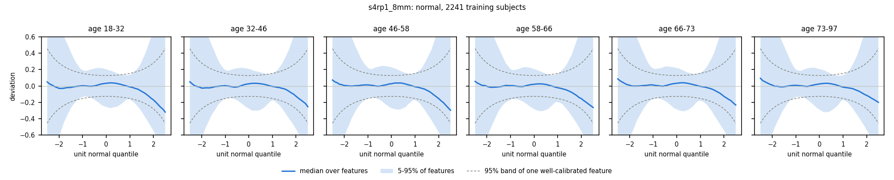
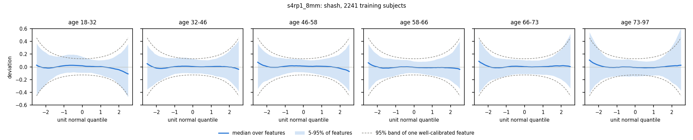

# NeuroGAMLSS

Vectorized GAMLSS normative models for voxel- and vertex-wise brain MRI, with z-maps and NormBrainAGE brain age.

> [!WARNING]
> This project is **currently under construction** and might contain bugs. **If you experience any issues, please [let me know](https://github.com/ChristianGaser/NeuroGAMLSS/issues)!**

NeuroGAMLSS fits a generalized additive model for location, scale and shape (GAMLSS) to every voxel or vertex of a reference sample at once. Each model describes how a brain measure is distributed as a function of age, sex, scanner site and optional covariates such as image quality measures. New subjects then get deviation maps (z-maps) at their chronological age. NormBrainAGE, the brain-age module, uses the same kind of models in the opposite direction: it estimates the age at which a subject's data are most likely.

- **Distribution families:** sinh-arcsinh (SHASH, the default) for skewed or heavy-tailed voxel data, normal for near-Gaussian data, and generalized gamma (GG) as in Brain Charts for positive data.
- **Age curves:** natural cubic splines for location and scale, whose flexibility is chosen for each training sample by cross-validation. The shape is constant or, where BIC prefers it, also a function of age.
- **Speed:** all voxels are fitted together, in parallel threads. SHASH models for 30,000 voxels and 2,241 subjects take one to two minutes on a laptop.
- **Sites and covariates:** sites enter as fixed effects, and new sites are adapted with their control subjects. Covariates such as image quality measures can enter the mean and the standard deviation.
- **Diagnostics:** Q statistics and worm plots by age group show how well the models fit.
- **Saved models:** fitted models are stored as `.mat` or `.npz` files with a JSON description, so new data can be scored without the training data.
- **NormBrainAGE:** maximum-likelihood brain age with a standard error, regional brain ages for the brain lobes and a deviation score that aging does not explain.

The statistical details are in [docs/models.md](docs/models.md). A draft methods section for NormBrainAGE is in [NDM_methods.md](NDM_methods.md).

## Installation

NeuroGAMLSS is a single Python file, [neurogamlss.py](neurogamlss.py), plus the lobe atlas in [atlases/](atlases/). It needs Python 3.9 or newer.

| Package | Version | Needed for |
|---|---|---|
| NumPy | 1.21 or newer | everything |
| SciPy | 1.7 or newer | everything |
| h5py | 3.0 or newer | MATLAB v7.3 input files |
| nibabel | 3.0 or newer | lobe atlas of surface data, `--parcellation` |
| matplotlib | 3.3 or newer | worm plots, `--diagnostics` |

The tests ran with Python 3.9, NumPy 2.0 and SciPy 1.13. [requirements.txt](requirements.txt) lists all packages, and [pyproject.toml](pyproject.toml) describes the project for pip. Either run the script from the cloned folder:

```bash
git clone https://github.com/ChristianGaser/NeuroGAMLSS.git
cd NeuroGAMLSS
pip install -r requirements.txt
python neurogamlss.py --help
```

Or install it in editable mode, which also adds the command `neurogamlss`. The extra `all` adds the three optional packages, and `test` adds pytest:

```bash
pip install -e ".[all]"
neurogamlss --help
```

The lobe atlas is read from the `atlases` folder next to the script, which an editable install keeps in place. `NEUROGAMLSS_ATLAS_DIR` points to another folder.

## Input data

The inputs are mat-files written by `BA_data2mat.m` of the [BrainAGE toolbox](https://github.com/ChristianGaser/BrainAGE), for example from CAT12 segmentations or surface measures.

| Variable | Content |
|---|---|
| `Y` | data, subjects × voxels or vertices |
| `age` | age in years; 0 or NaN for an unknown age |
| `male` | sex, 1 for male and 0 for female (optional) |
| `ind` | 1-based vertex indices of surface data |
| `dim` | volume dimensions (optional) |

Subjects with an age of 0 or NaN count as of unknown age. They are left out of fitting, of the controls and of the evaluation. NormBrainAGE still estimates their brain age, which needs no age, but their BrainAGE and z-maps are NaN. NeuroGAMLSS reports how many subjects this affects, and it stops if fewer than 10 training subjects or no controls have a valid age.

File names follow the BrainAGE convention, for example `s4rp1_8mm_IXI547_CAT12.9.mat`. The part up to the resolution, here `s4rp1_8mm`, names the model. Surface data are recognized by `mesh` in the file name.

Files are combined in two ways:

- **`+` joins sites.** Files joined with `+` are concatenated into one sample, and each file becomes one site, for example `--train A.mat+B.mat+C.mat`.
- **Spaces separate models.** Several files after `--train` or `--test`, separated by spaces, are different models of the same subjects, for example gray and white matter. NeuroGAMLSS stops with a hint if their subjects differ.

### Voxels and vertices that are modelled

Near-empty voxels give z-scores without meaning, because a tiny absolute difference becomes a large z, and they cause almost all fits that do not converge. NeuroGAMLSS therefore models a voxel or vertex only if its values in the training sample are finite and not constant, and if their mean reaches a threshold. `--mask-threshold` sets the threshold in two forms:

- **A number** is an absolute value. The default for volume data is 0.05, a tissue density.
- **A percentage** such as `5%` refers to the median of the means of all voxels or vertices. This is the default for surface data, whose measures have different units.
- **Zero** keeps all voxels and vertices with finite, varying values.

| Default mask in the example data | Removed |
|---|---|
| Gray matter, 4 and 8 mm | 5.4–5.5% of voxels |
| White matter, 4 and 8 mm | 13.2–13.5% of voxels |
| Thickness, area, depth, fractal dimension, gyrification, toroGI | none |
| Sulc | 7.5% of vertices, the gyral crowns where most values are zero or negative |

The surface files of `BA_data2mat.m` already leave out the medial wall through the vertex index `ind`, and medial-wall values stored as NaN or as a constant zero are dropped anyway. The mean is used rather than the minimum. A minimum rule would drop border voxels where older subjects lose tissue, which is the effect of interest, and half of the sulc vertices.

The mask is fixed when the models are fitted and stored with them. Z-maps and brain age use the same mask. Masked voxels and vertices are NaN in the z-maps and left out of brain age. Low values of single test subjects are data and are not masked.

## Quick start

### Normative models and z-maps

Fit SHASH normative models to a lifespan sample of four sites, check the fit, and save the models:

```bash
python neurogamlss.py --normative-only \
    --train s4rp1_4mm_CamCan651_CAT12.9.mat+s4rp1_4mm_IXI547_CAT12.9.mat+s4rp1_4mm_OASIS3_549_CAT12.9.mat+s4rp1_4mm_SALD494_CAT12.9.mat \
    --save-model lifespan_gm4.npz --diagnostics --out lifespan_gm4
```

Score a new sample with the saved models. Here, its first 108 subjects are healthy controls, which adapt the models to the new scanner:

```bash
python neurogamlss.py --normative-only --model lifespan_gm4.npz \
    --test s4rp1_4mm_ADNI_CAT12.9.mat --adjust 1:108 --parcellation --out adni_gm4
```

This writes the z-maps to `adni_gm4_zmaps_s4rp1_4mm_ADNI_CAT12.9.mat` and the mean z of each lobe to `adni_gm4.csv`.

### NormBrainAGE

Estimate brain age with 10-fold cross-validation from two models of the same subjects, gray and white matter at 8 mm:

```bash
python neurogamlss.py --train s4rp1_8mm_NKIe1239_CAT12.9.mat s4rp2_8mm_NKIe1239_CAT12.9.mat \
    --kfold 10 --parcellation --out nkie
```

Train on one sample and test another, and also write z-maps. Each training file defines one model, and the test files must follow the same order:

```bash
python neurogamlss.py --train s4rp1_8mm_A_CAT12.9.mat s4rp2_8mm_A_CAT12.9.mat \
    --test s4rp1_8mm_B_CAT12.9.mat s4rp2_8mm_B_CAT12.9.mat --adjust 1:108 --zmaps --out B
```

## Distribution families

`--family` selects the distribution of the voxel- and vertex-wise models.

| Family | Parameters | Use |
|---|---|---|
| `shash` (default) | location μ, scale σ, skewness ν, tail weight τ | voxel and vertex maps |
| `normal` | mean μ, standard deviation σ | near-Gaussian data such as regional means, quick runs |
| `gg` | μ, σ, shape ν | positive data such as global volumes, compatibility with Brain Charts |

**SHASH** is the sinh-arcsinh distribution of Jones and Pewsey (2009) in the SHASHo2 form of the R package gamlss.dist. It contains the normal distribution as the special case ν = 0 and τ = 1. Each fit starts from the normal model. Priors shrink ν and log τ toward the normal distribution with a standard deviation of 1 (`--shape-prior`). τ stays between 0.2 and 2, and `--tau-max` sets the upper bound. The upper bound matters most, because very light tails make z-scores explode for values outside the training range. In SHASH, μ and σ are location and scale, not mean and standard deviation.

**Normal** is the classical location-scale model. It is roughly ten times faster than SHASH and is always used for the principal component scores of NormBrainAGE, which are close to Gaussian.

**GG** is the generalized gamma distribution that Brain Charts used (Bethlehem et al., 2022). It needs positive data, and features with values of zero or below get no model. The log-normal distribution is its special case ν = 0. On positive gray matter voxels, it removed most of the skewness left by the normal model, though less than SHASH.

**Flexibility of the age curves.** By default, NeuroGAMLSS chooses the spline degrees of freedom (df) of location and scale for each training sample and model by 5-fold cross-validation, with folds stratified by site and age. The same df apply to all voxels. In tests, one setting for all voxels did as well as choosing the df voxel by voxel, a proxy for penalized splines with automatic smoothing such as pb(). The criteria differ between the two kinds of models:

- **z-maps:** normal models of 1,000 random voxels are compared by their held-out likelihood, using the median over voxels. The df of location are chosen first, from 2 to 12, and then those of scale, from 1 to 5.
- **NormBrainAGE:** the models of the component scores are compared by the mean absolute error of the held-out brain age. The df of location range from 1 to 8 and those of scale from 1 to 4.

In the example data, the choice took 20 to 80 s for each kind of model and picked 2 or 3 df for location and 1 or 2 for scale, stiffer than the former fixed 5 and 3. On an independent sample, this made brain age more accurate and its standard errors better calibrated. `--df-mu` and `--df-sigma` set fixed df instead. The chosen df are stored in the model file, its JSON description and all output files. With `--kfold`, the df are chosen once on all subjects before the folds, so the cross-validated errors are slightly optimistic.

**Age-dependent shape.** By default, the shape parameters are constant for each voxel. `--shape-df 3` also fits ν and τ as natural splines of age and keeps them for a voxel only where the Bayesian information criterion (BIC) prefers them. In the example data, BIC chose age-dependent shape for about 7% of the voxels, and fitting took about twice as long. Use it where the diagnostics show that the shape misfit depends on age.

## Checking the fit

`--diagnostics` checks the fitted models on the training data in ten age groups of equal size. For every voxel, Q statistics (Royston and Wright, 2000) test whether the mean, variance, skewness and kurtosis of the z-scores match the standard normal distribution. The summary table reports, for every model, the share of voxels with p < 0.05 for each moment, which is 5% for a perfect model. It also reports the median absolute skewness and excess kurtosis of the z-scores and the share of voxels whose fit did not converge.

Gray matter at 8 mm from 2,241 subjects of CamCAN, IXI, OASIS-3 and SALD gave these shares of voxels with p < 0.05, with the default mask and df:

| Family | Mean | Variance | Skewness | Kurtosis | Median absolute skewness |
|---|---|---|---|---|---|
| normal | 12% | 25% | 87% | 84% | 0.51 |
| shash | 20% | 13% | 38% | 34% | 0.02 |

Worm plots (van Buuren and Fredriks, 2001) show the same in more detail. Each panel is a detrended normal QQ plot of the z-scores in one of six age groups, summarized over voxels. A well-fitting model has a flat worm inside the dashed band.





With thousands of training subjects, the Q statistics detect even small misfit. Judge the size of a misfit by the worm plots and the skewness, not by the p-values alone.

## New sites and covariates

**Training sites.** Files joined with `+` are sites, which enter the location as fixed effects. Without adaptation, z-scores refer to the size-weighted average of the training sites.

**New sites.** `--adjust` lists the healthy control subjects of the test sample as 1-based indices, for example `1:108,150,160:170`. For every voxel, the z-scores of the controls are then rescaled to mean 0 and standard deviation 1. This is the location and scale step of ComBat without empirical Bayes shrinkage. `--correction` chooses how brain age uses the controls:

| Value | Brain age | z-maps |
|---|---|---|
| `offset` (default) | subtract the controls' median BrainAGE | adapted |
| `adapt` | adapt the normative models | adapted |
| `agefree` | adapt the models at the controls' estimated brain ages, then subtract the offset | adapted at the estimated brain ages, not with `--normative-only` |
| `trend` | remove a linear trend of BrainAGE on age | adapted |
| `none` | no correction | not adapted |

**Covariates.** `--train-cov` and `--test-cov` give one table per sample with one row per subject, in the order of the mat-files. The tables are text files separated by commas, semicolons, tabs or spaces, with an optional header. Tables joined with `+` belong to samples joined with `+`. By default, every numeric column enters the mean. `--cov-mean` and `--cov-sd` choose the columns for the mean and for the log standard deviation, by name or number, and `--cov-df` uses natural splines instead of linear terms.

```bash
python neurogamlss.py --normative-only --train A.mat --train-cov A_iqm.csv \
    --cov-mean IQR --cov-sd IQR --save-model A_norm.npz
python neurogamlss.py --normative-only --model A_norm.npz --test B.mat --test-cov B_iqm.csv --out B
```

Covariates are centred at their training median, and z-scores condition on every subject's own values. Missing test values are replaced by the training median. Constant or collinear covariates are dropped with a note. A covariate that changes strongly with age competes with age and can make brain age less accurate.

## NormBrainAGE

NormBrainAGE reduces the training data of each model by principal component analysis (PCA), by default to 100 components for the whole brain and, with `--parcellation`, for each lobe. Normal location-scale models describe the component scores as functions of age, and their residual correlation is estimated from the training sample. The brain age of a subject is the age that maximizes the likelihood of its scores. The method yields:

- **BrainAGE,** the difference between brain age and chronological age, with a standard error from the curvature of the likelihood.
- **Regional BrainAGE** for the lobes with `--parcellation`.
- **A non-aging deviation,** the normal score of the Mahalanobis distance of the subject's z-scores at its brain age. It measures the atypicality that an older or younger brain does not explain.
- **An ensemble** of all models, weighted by generalized least squares (`--ensemble`).

PCA is used only for brain age. The voxel-wise normative models of the z-maps never use it. `--pca 0` fits brain age to every voxel with a low-rank residual correlation instead. This is less accurate and gives standard errors that are too small.

`--warp` transforms every voxel with a sinh-arcsinh function before PCA. Unlike SHASH, the warp does not depend on age, so it can be applied before PCA. In our tests, it did not change the accuracy of brain age, so it is off by default.

When the training data are given, a Python replica of the GPR BrainAGE of the BrainAGE toolbox runs for comparison, unless `--no-gpr` is set.

## Saved models

`--save-model` writes the fitted models to a `.npz` file (NumPy) or a `.mat` file (MATLAB struct `NDMmodel`). Neither format runs code when it is loaded. A JSON file with the same name describes the models. It records the settings, the training sample with its age range and sites, and the covariates. For every model, it also records the feature space, the mask with its threshold and the number of voxels or vertices used, and the chosen df with the scores of the cross-validation.

`--model` applies a saved file to `--test` data instead of fitting new models. NeuroGAMLSS stops with an error if the test data do not match the models: surface instead of volume data or the reverse, or a different number of voxels or vertices, resolution, volume dimensions or vertex indices. It also stops if the models use sex or covariates that the test data lack. It reports test subjects outside the training age range or covariate range, where the models extrapolate linearly.

## Outputs

`--out` sets the prefix of all output files.

| File | Content |
|---|---|
| `<out>_zmaps_<model>.mat` | struct `NDMzmap`: `Z` (subjects × features), `converged`, `family`, `df_mu`, `df_sigma`, `mask_threshold`, `age`, `male`, `model`, `ind`, and with `--parcellation` `regional_z`, `regions`, `region_names` |
| `<out>.csv` | normative models only: mean z of each lobe for every subject (with `--parcellation`) |
| `<out>.mat`, `<out>.csv` | brain age: struct `NDM`, including the df and the mask threshold of every model in `df_mu`, `df_sigma` and `mask_threshold`, and a table with BrainAGE, standard errors and deviations of every model and of the ensemble |
| `<out>_diagnostics.csv` | summary of the diagnostics for every model |
| `<out>_diagnostics_<model>.mat` | struct `NDMdiag`: `Q`, `p_Q` and `df_Q` (4 × features: mean, variance, skewness, kurtosis), `converged`, `age_groups`, `family`, `model`, `df_mu`, `df_sigma`, `mask_threshold` |
| `<out>_wormplot_<model>.png` | worm plots |

`Z` has the same feature order as `Y` in the input file, so it maps back to the image or surface like the input data. Features without a model are NaN, such as voxels outside the mask. `converged` is 1 for voxels whose fit converged, 0 for the others and NaN without a model.

## Command-line options

`python neurogamlss.py --help` lists all options. The most important ones:

| Option | Default | Meaning |
|---|---|---|
| `--train FILE ...` | | training mat-files, one per model with the same subjects; `+` joins the files of several sites |
| `--test FILE ...` | | test mat-files, one per model with the same subjects, in the order of `--train` or of the saved models |
| `--model FILE` | | apply saved models instead of `--train` |
| `--save-model FILE` | | save the fitted models as `.npz` or `.mat` |
| `--normative-only` | off | only voxel- or vertex-wise normative models and z-maps, no brain age |
| `--zmaps` | off | also write z-maps when estimating brain age |
| `--family` | `shash` | `shash`, `normal` or `gg` |
| `--shape-df` | 0 | spline degrees of freedom of the shape parameters, chosen by BIC per voxel |
| `--tau-max` | 2 | upper bound of the SHASH tail parameter τ |
| `--shape-prior` | 1 | standard deviation of the priors on the shape parameters |
| `--df-mu`, `--df-sigma` | `auto` | spline degrees of freedom of age for location and scale, chosen by cross-validation or given as numbers |
| `--mask-threshold` | 0.05 or 5% | voxels and vertices that are modelled: their training mean must reach this value or this percentage of the median mean; 0 for all |
| `--diagnostics` | off | Q statistics and worm plots of the training fit |
| `--adjust` | | 1-based indices of the test controls |
| `--correction` | `offset` | use of the controls, see above |
| `--test-male` | | text file with the sex of the test subjects, if the mat-files lack it |
| `--train-cov`, `--test-cov` | | covariate tables |
| `--cov-mean`, `--cov-sd`, `--cov-df` | all, none, 1 | covariates in the mean and in the log SD, and their spline degrees of freedom |
| `--parcellation` | off | lobe-wise brain age and lobe-wise mean z |
| `--pca` | 100 | NormBrainAGE only: principal components per model and region, 0 for every voxel |
| `--warp` | off | NormBrainAGE only: sinh-arcsinh warp of every voxel before PCA |
| `--kfold` | 10 | folds of the cross-validation without `--test`, 0 with `--save-model` |
| `--age-range MIN MAX` | all | age range of the training subjects |
| `--ensemble` | `gls` | weights of the brain age ensemble: `gls`, `mae` or `mean` |
| `--no-gpr` | off | skip the GPR comparison |
| `--jobs` | half the CPU count | threads for fitting the voxel- and vertex-wise models; the results do not depend on it |
| `--out` | `neurogamlss_results` | prefix of the output files |

## Python interface

The classes can also be used directly. `VoxelModel` handles mat-files, and `NormativeModel` works on arrays.

```python
import numpy as np
import neurogamlss as ng

train = ng.load_data('s4rp1_8mm_A_CAT12.9.mat+s4rp1_8mm_B_CAT12.9.mat')
vm = ng.VoxelModel(family='shash').fit(train)
test = ng.load_data('s4rp1_8mm_C_CAT12.9.mat')
z = vm.zmaps(test, ctrl=np.arange(50))['Z']     # adapted with the first 50 subjects

m = ng.NormativeModel(df_mu=5, df_sigma=3, family='shash').fit(Y, age, male, site)
z = m.zscores(Y_new, age_new, male_new)          # columns m.valid of Y_new
```

## Speed

NeuroGAMLSS fits chunks of voxels in parallel threads, by default as many as half the CPU count, which on most machines are the physical or performance cores. `--jobs` sets another number, and the results do not depend on it. On an Apple M2, four threads were 2.4 times faster than one core. More threads did not help there, because the other four cores are slower efficiency cores and the computation is limited by memory speed.

Times for fitting with fixed df to 2,241 training subjects on an Apple M2 laptop, with four threads and the default mask:

| Data | Voxels | normal, gray matter | normal, white matter | shash, gray matter | shash, white matter |
|---|---|---|---|---|---|
| 8 mm volume | 3,747 | 1 s | 1 s | 7 s | 13 s |
| 4 mm volume | 29,852 | 8 s | 11 s | 56 s | 97 s |

White matter is more skewed than gray matter, and its SHASH fits take longer. Memory is bounded by processing the voxels in chunks.

The automatic choice of the df adds the following times for gray matter. Fixed df given with `--df-mu` and `--df-sigma` skip it.

| Choice of the df | 8 mm | 4 mm |
|---|---|---|
| z-map models | 20 s | 20 s |
| brain age models | 40 s | 79 s |

## Tests

```bash
pip install -e ".[all,test]"
python -m pytest
```

The tests use simulated data. They check the SHASH derivatives, the GG density and normal scores, parameter recovery, the τ bound, the BIC choice of age-dependent shape, the calibration of the Q statistics, the choice of the df, the mask, saving and loading of all families in both formats, and the command line.

## Limitations

- **Independent voxels.** Every voxel is fitted on its own, without spatial smoothing of the parameters.
- **Fixed site effects.** Sites are fixed effects of the location. Many small sites would be better served by random effects, which are not implemented.
- **Non-converged fits.** Without the mask, about 1% of the SHASH fits did not converge, almost all in near-empty voxels. With the default mask, none of 3,546 gray matter voxels and 1 of 3,242 white matter voxels at 8 mm failed to converge. Such fits keep the best parameters found and are flagged in `converged`.
- **Bounded data.** Gray and white matter densities are bounded by 0 and 1. SHASH describes the resulting skewness well but is not bounded itself.

## References

- Bethlehem, R.A.I., Seidlitz, J., White, S.R., et al., 2022. Brain charts for the human lifespan. Nature 604, 525–533.
- de Boer, A.A.A., Bayer, J.M.M., Kia, S.M., et al., 2024. Non-Gaussian normative modelling with hierarchical Bayesian regression. Imaging Neuroscience 2, 1–36.
- Fortin, J.-P., Cullen, N., Sheline, Y.I., et al., 2018. Harmonization of cortical thickness measurements across scanners and sites. NeuroImage 167, 104–120.
- Fraza, C.J., Dinga, R., Beckmann, C.F., Marquand, A.F., 2021. Warped Bayesian linear regression for normative modelling of big data. NeuroImage 245, 118715.
- Gardner, M., Shinohara, R.T., Bethlehem, R.A.I., et al., 2024. ComBatLS: a location- and scale-preserving method for multi-site image harmonization. bioRxiv.
- Jones, M.C., Pewsey, A., 2009. Sinh-arcsinh distributions. Biometrika 96, 761–780.
- Kalc, P., Dahnke, R., Hoffstaedter, F., Gaser, C., Alzheimer's Disease Neuroimaging Initiative, 2024. BrainAGE: Revisited and reframed machine learning workflow. Human Brain Mapping 45, e26632.
- Rigby, R.A., Stasinopoulos, D.M., 2005. Generalized additive models for location, scale and shape. Journal of the Royal Statistical Society, Series C 54, 507–554.
- Rigby, R.A., Stasinopoulos, D.M., Heller, G.Z., De Bastiani, F., 2019. Distributions for Modeling Location, Scale, and Shape: Using GAMLSS in R. Chapman and Hall/CRC, Boca Raton.
- Royston, P., Wright, E.M., 2000. Goodness-of-fit statistics for age-specific reference intervals. Statistics in Medicine 19, 2943–2962.
- van Buuren, S., Fredriks, M., 2001. Worm plot: a simple diagnostic device for modelling growth reference curves. Statistics in Medicine 20, 1259–1277.
